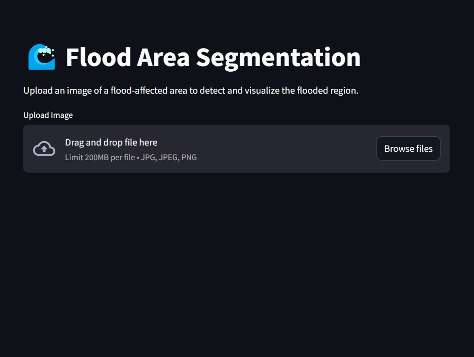
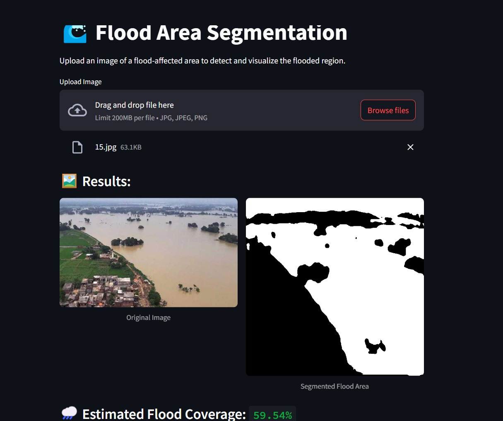
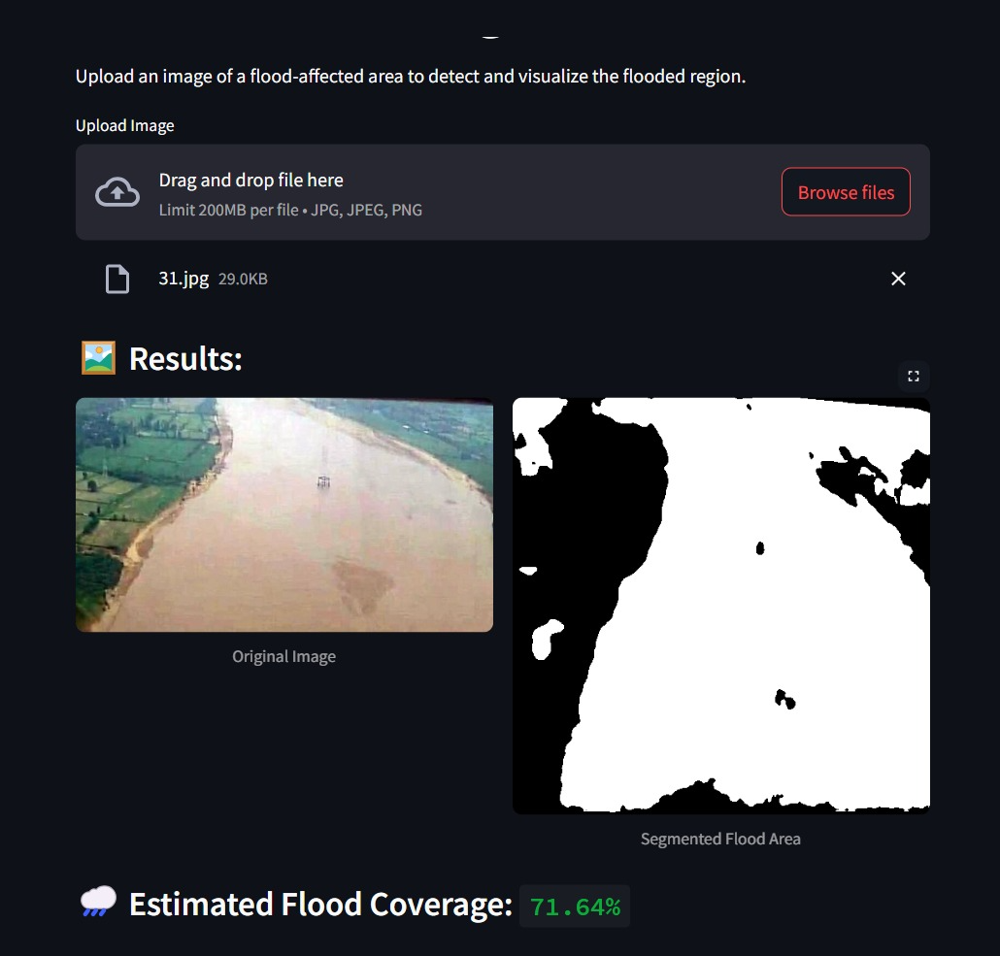

🌊 Flood Segmentation using U-Net
This project is a Deep Learning-based Web Application that performs semantic segmentation to identify flooded areas in images. Built using U-Net architecture, Keras, and Streamlit, the app provides a simple interface to upload flood images and visualize the predicted segmentation masks.

A look of what does it looks like:

🚀 Features
Upload any flood-related image.

Get pixel-wise segmentation mask showing flooded regions.

Runs completely in the browser using Streamlit UI.

Built-in model caching to speed up repeated predictions.

🧠 Model Overview
Architecture: U-Net

Framework: TensorFlow / Keras

Trained on custom flood dataset with corresponding masks.

Loss Function: Binary Crossentropy

Evaluation Metrics: Accuracy, IoU (Intersection over Union)

📁 Project Structure
├── app.py                  # Streamlit web app

├── flood_save.h5          # Trained U-Net model

├── README.md              # Project documentation

├── sample_data/           # Optional image data

└── requirements.txt       # Python dependencies (optional)

💻 How to Run Locally
Clone this repository:

Install dependencies:
pip install -r requirements.txt

Run the Streamlit app:
streamlit run app.py

The app will open at http://localhost:8501

🧠 Future Improvements
Improve model accuracy with larger and more diverse datasets.

Add real-time video flood segmentation.

Deploy permanently with GPU support using platforms like Paperspace, HuggingFace Spaces, or AWS/GCP with GPU.

🙋‍♂️ Author
Saket Ruia

📜 License
This project is licensed under the MIT License.

